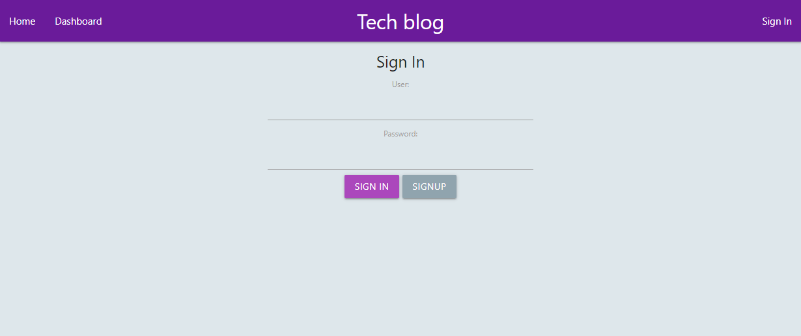
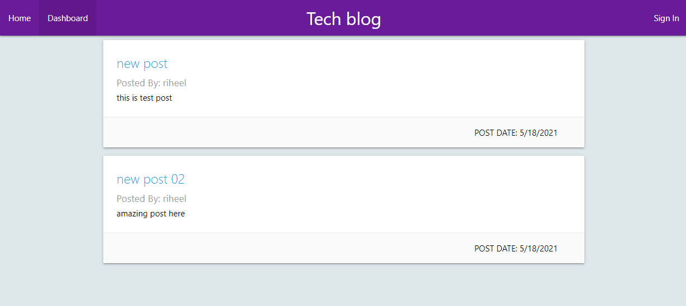

# tech-blog
[](https://opensource.org/licenses/MIT)

## Description  
Basic tech blog in CMS style to post news, opnions and comments.

**LIVE URL:** https://evening-hamlet-12351.herokuapp.com/




## Table of Contents

- [Installation](#Installation)<br>
- [Usage](#Usage)<br>
- [Contributing](#Contributing)<br>
- [Tests](#Tests)<br>
- [License](#License)<br>
- [Questions](#Questions)


## Installation  
- clone the project
- Open terminal
- change directory to the project directory
- run below: <br>
```
npm i
```
## Usage 
- Open
- change directory to the project directory
- run below: <br>
```
npm start
```
## License

[MIT](https://opensource.org/licenses/MIT)


## Questions
Github: [@riheelh](www.github.com/riheelh) <br>
Email: info@demo.com